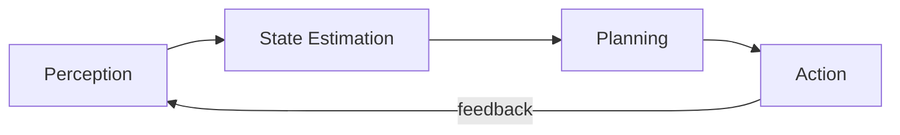

This post is a living template. Duplicate its folder for each new article so you always start with diagrams, code, and math wired up. Delete this post (or keep `draft: true`) once you're comfortable with the workflow.

## Diagrams (Mermaid — written as code, version-controlled)

Write architecture and flow diagrams directly in markdown. They render as crisp SVG on your site and diff cleanly in git. For Substack, export the rendered diagram as an image and upload it.



For hand-drawn or highly custom visuals, author them in Excalidraw or draw.io, export as **SVG**, and place the file in this post's folder.

## Code (syntax-highlighted)

Fenced code blocks are highlighted automatically (github-light / dracula). On Substack these become plain monospace blocks.

```python
def active_perception(belief, actions):
    """Pick the action that most reduces uncertainty about the world."""
    return min(actions, key=lambda a: expected_entropy(belief, a))
```

## Math (KaTeX)

Inline math like $a^2 + b^2 = c^2$ and display math both render on your site. On Substack, paste display equations as images.

$$
\mathcal{L}(\theta) = \mathbb{E}_{(s,a)\sim \mathcal{D}}\big[\, \| \pi_\theta(s) - a \|^2 \,\big]
$$

## Mirroring to Substack

1. Publish here first (this is your canonical, durable copy).
2. In Substack, create the post and **paste the full text**.
3. Replace each diagram/equation with its exported image; drop code into Substack code blocks.
4. In the Substack post's Settings, set **Canonical URL** to this page so SEO credit flows to your site.
